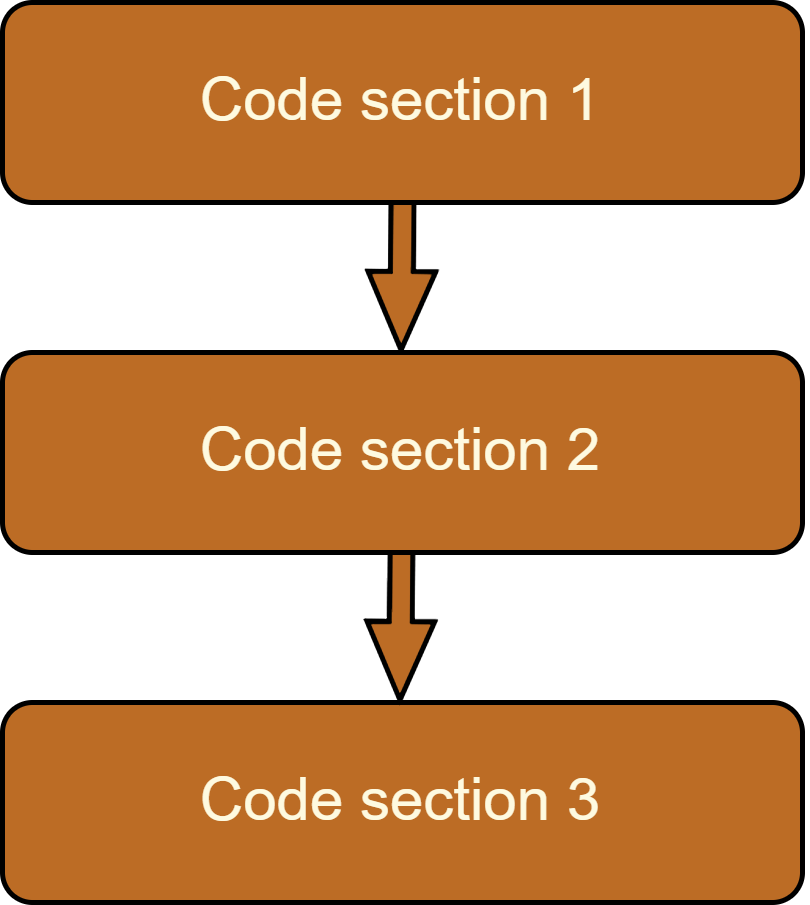
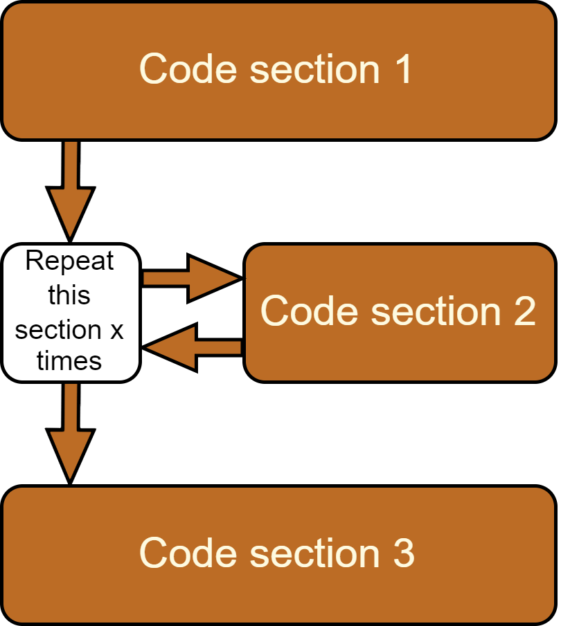
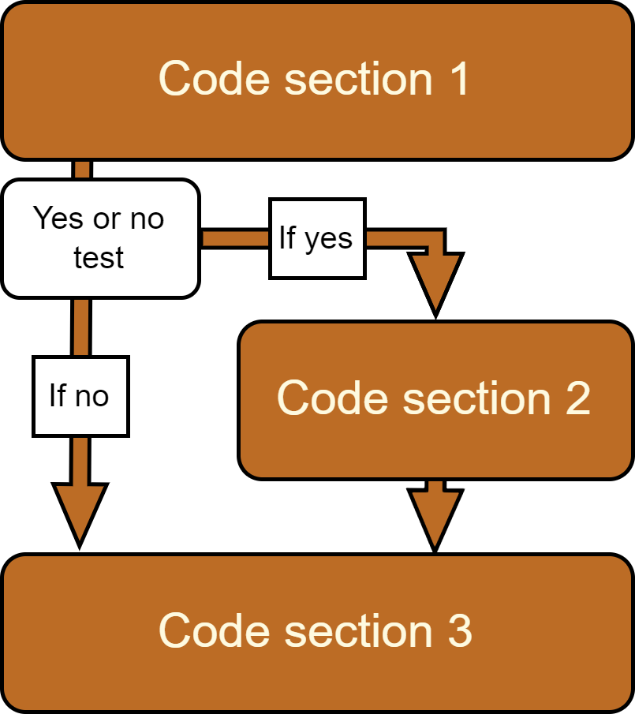

```{r setup, include=FALSE}
options(htmltools.dir.version = FALSE)
```

---
class: inverse, center, middle

# Session overview

---
class: middle

## Scope of this session

.pull-left[
  The *DEC Foundations of Python* does not require
  that you have any background in programming. 
  
  If you have no programming background, 
  then this session will prepare you for the rest of the course.
  
  To be successful in programming data work in Python code,
  you need to learn two skills:
  
  * Learn how to write Python code 
  * Learn how to approach a task like a coder
]

.pull-right[
  **Content of this session:**
  
  1. Why programming? Work flow in data work programming
  
  1. Why Python?
  
  1. How does one write "_good code_"?
  
  1. Some common concepts in programming 
]


---
class: middle

## What we assume about you:
.pull-left[
  
  Python can be used for countless of topics in computer science. 
  However, the scope of this training is limited to:
  
  1. How to use Python for data work. Numbers, text data, geo-data etc.
  
  1. Participants have some experience working with data. 
  For example, extensive work in Excel or some work in Stata or R.
  
  1. This course does not include how to use Python 
  for software development, backends for websites etc.
]

.pull-right[
  
  IMAGE OF EXCLE AND STATA LOGO WITH ARROW TOWARDS PYTHON LOGO
]

---
class: inverse, center, middle

# Why programming? 
# Work flow in data work programming

---
class:  middle

## Why use programming for data work? 

.pull-left[

  Data work should be very exact. Computers are more exact than humans.

  Instead of manually working directly on the data, 
  we write code that are instructions for computers 
  on what to do with the data.
  
  Since computers are very exact, 
  our code becomes an exact record of what was done to the data 
  and how outputs were generated.
]

.pull-right[

]

---
class:  middle

## Compare Excel and programming

  | | Excel | Programming |
  |---------|-----|-----|
  | Are manual edits done directly to the files containing data? | Yes, we manually work directly in the file containing the raw data and and outputs | We only manually edit the code which is in files from files with data and output.  |
  | Can we write instructions for the computer to modify our data? | Yes, this is an option (Excel formulas) | Yes, and this is the only way (code)  |
  | Can the instructions to modify the data be mixed with manual edits? | Yes, and it is common. | No, code should always start from unaltered raw data |
  | Do we have an unambiguous way of sharing what was done to the data? | Only formulas are shown, not manual edits | Yes, it is the code |
  | Is it easy for a reviewer to reproduce all steps? | Its challenging or impossible to follow any manual edits as there is no record of them | Yes, anyone who has the code and have access to the input data can reproduce everything |

---
class: middle

## Programming is like writing recipes

.pull-left[
  ### Sponge cake:
  * Set oven on 200C
  * Melt 200g butter and mix with 200g sugar
  * Mix in 4 eggs - one at the time
  * Mix in 200g flour
  * Bake in the middle of the oven for 30 min
]

.pull-right[
  ### Data science visualization:
  * Get GDP per capita data from for all countries
  * Get investment data from all WB client countries
  * Remove data that was not found in both dataset
  * Sort ascendingly on GDP per capita
  * Export a scatter plot and format the colors and the text
]


---
class: middle

## Data work in programming

.pull-left[

Ingredients in a cooking recipe can vary.

Inputs to code can and should be very exact. 
How that is done depends on the type of data.

* _Primary data_: Properly back-up of raw data
* _Secondary shared data_: Cite and back-up the data source
* _Secondary published data_: Cite the data source

Derivatives of original data (new data products and analysis outputs) should be created from original data and code only.

See [DIME Analytic's book](http://hdl.handle.net/10986/35594) for more details.

]

.pull-right[

]


---
class: middle

## Code is how you communicate data science

.pull-left[
  Chefs use recipes to communicate about food
  
  Data scientists use code to communicate about data work.
  
  A cook book of poorly written recipes will lead to bad food. 
  
  Poorly written code will lead to bad communication about data work
]

.pull-right[PICTURE]


---
class: middle, center

.large[
  .margin-bottom100[
    Code is not just a means to an end - **code is an end in itself**
  ]
  
  The code is a comprehensive and exact method
  to communicate the project's data work, 
  and **the code is an output** just as much as 
  the project's final report, data visualizations, etc.
]


---
class: inverse, center, middle

# Why Python?

---

class: 

## Why Python?


.pull-left[

Why are there so many programming languages? How does Python compare to other languages?

**Free/Open-source**: Python is and will always be 100% free to use

**Easy syntax**: Python code reads more similarly to regular English

**Widely used**: Many users means many user developed tools

**#1 in data science**: The language with most data science tools

**General purpose**: Python can be used for data science, servers, software etc.
]

.pull-right[

]

---
class: inverse, center, middle

# How does one write good code?

---

---
class: middle

## Learn how to commnuicate data science well

.pull-left[
  **Correct code:** Code that generates correct results
  
  **Good code:** Code that can be understood and used by others
  
  Code should be **both** correct code and good code.
  Only then is code useful as an output of your data work.
  
  Start by writing _correct code_, 
  then keep going to write _good code_.
]

.pull-right[
]

---
class: middle

## Trial and error!

**Writing correct code usually takes many errors**

Don't be afraid of making errors as the data is not edited the data directly! 

Even the best coders user trial and error - what makes them good is how 

---

class: middle

## Errors and bugs

.pull-left[
* Errors is a part of programming and they should be your friend
  
* Python always give you some message when there is an error
  
* Learn how to interpret error messages - Google them

* You will have thousands of errors and bugs - 
test run your code and find out where it breaks
]

.pull-right[
  PICTURE TEXT ERROR IN HEART
]


---
class: middle

## When the code works you are only half-done

How to make correct code into good code?

Ask yourself 
"_Would someone with your level of Python knowledge
be able to follow the code?_"

* Simplify
* Peer-review
* Document

Settling for "_just_" correct code does not 
save you or your team any time in the long run.


---

class: middle

## Re-use code

Since the instructions (code) is separate from input and output,
we can re-use code blocks within and across projects. An important paradigm in coding is **DRY** (don't repeat yourself)

Three levels of re-using code:

* **Copy-paste:** Copy a block a code of modify it to fit the context

* **Functions:** A block of code you written that can be referenced across the project

* **Library:** Code packages developed by others to solve difficult tasks but made easy use in any project

***

**Do not re-invent wheels**

* Aim to have each section of code be built on someone else' efforts
* Someone else's efforts can be the efforts of past you 
* Compare with Excel - how do you build on the efforts of other users?

---
class: middle

## Learn good code from expert coders

.pull-left[
  **Be careful** - expert code examples can be deceptive
  
  Advanced code examples is usually meant to explain
  how to do something complex _correctly_, 
  and not how to write _good code_.
  
  An advance example might not fit your project, 
  regardless how _correct_ it solved a well-defined school book example.
  Use critical thinking.
]

---
class: middle

## Learn good code from peer coders
.pull-left[
  Read code from real world data work examples, 
  written by people at or just above your skill level
  
  This will teach you lessons 
  much more applicable to your day-to-day work,
  than school book examples
  
  Code written by someone at your level 
  will teach you much more about how you
  can become better at writing good code.
  
]

---
class: middle,

## Documentation - comments

.pull-left[

  All programming languages has a feature called _comments_. 
  
  Comments are text in the same file as the code 
  that the computer skips when running the code.
  
  Comments' only (but important) purpose
  is to provide context for a human reading the code.
  
  Comments best compliment the code if 
  they explains why the code is written a certain way.
]

.pull-right[

  | OK comment | Good comment |
  | --- | --- |
  | _What_ code does | _What_ code does **and** _why_ |
  | `Load data` | `Loading region definitions shared by NGO used in sampling` |
  | `Deleting variable "id" and "name"` | `Removing identifying variables to create a non-confidential data set` |
  
]

---
class: inverse, center, middle

# Some common concepts in programming 

---
class: middle

## Version control

.pull-left[

  _"Version control"_ refers to tools used to:

  * Keep track of multiple people 
  making different contributions 
  to the files of a project
  * Give access to previous versions
  of the files of a project
  
  
  Version control exists outside programming. 
  For example, `ctrl+z`, 
  restore files in OneDrive or Dropbox,
  recovered files in Windows, etc.
  
  In coding version control is much more comprehensive,
  and can track every single edit anyone in the team do.

]

---
class: middle

## Version control of code = Version control of all data work
  
  Code is very exact instructions on 
  how to create outputs from original data.
  
  If we handle the original data with the same level of exactness
  (backed-up or properly cited), 
  and if we version control our code, 
  then all outputs are also version controlled.
  
  Version controlling all work is perhaps
  the most valuable feature of programming.
  
  That standard for version control in code 
  is called _Git_ or _GitHub_.
  
---
class: middle

.pull-left[

  ## Code flow

  Just like a recipe, the instructions in code are read from top to bottom.
  
  Each "sections" in the diagram is a task 
  that can be a code block of one or many lines of code.
  
  In data work we repeat the same task on multiple parts of the data.
  It is not _good code_ to repeat the code multiple times. 
  We need a way to express a repeat.
  
  Similarly, some tasks only applies to some parts of the data.
  We need a way to express a condition.
]

.pull-right[
  ```{r, eval=TRUE, echo=FALSE,out.width = '75%'}
    
  ```
]

---
class: middle


.pull-left[

## Repeating parts of the code

We can repeat a section of code using **loops**.

Three ways of deciding how many times to repeat:
* **Hard coded**. Repeat an exact number of times. For example, 10 times

* **While-loop**. Repeat until a condition is met. For example, a match is found

* **Dynamically**. Use a characteristic in the data 
to decide the number of repeats. 
For example, repeat once for each country in the data set.

]

.pull-right[
  ```{r, eval=TRUE, echo=FALSE,out.width = '75%'}
    
  ```
]
---
class: middle


.pull-left[

## Sometimes skipping parts of the code

When repeating or re-using code, 
some sections does not always apply.
We use **if-conditions** to instruct the computer
when to skip some code. 

* Only execute certain blocks on certain countries in a loop

* Code intended to be re-used across projects can fit more cases
when **if-conditions** are used
to make the code adapt itself to what is needed in each context.

]

.pull-right[
  ```{r, eval=TRUE, echo=FALSE,out.width = '75%'}
    
  ```
]

---
class: middle

.pull-left[

  ## Code flow - combine it all
  
  Often loops and if-conditions are combined or they can be nested. 
  
  Session 2 of this course will show how this is done in Python. 
  
  Having neat, human readable and intuitive code flow 
  using loops and if-conditions,
  is important to make code _good code_.
]

.pull-right[
  ```{r, eval=TRUE, echo=FALSE,out.width = '75%'}
    knitr::include_graphics("img/code-flow-example.png")
  ```
] 

---
class: middle

## Summary in terms of research standards

**1. Transparency**<br>
You can share your code as a fully transparent log
of everything ever done to the input data.
This log can be shared with others,
but the person likely to benefit from this most frequently is yourself.

**2. Replication**<br>
As the code is a transparent log of what was done to the data,
anyone else who has access to the input data can use your code
and run it to verify that they get the same results as you and your team.
This makes your results more credible
and is becoming a standard requirement in research.

**3. Re-usability/automation**<br>
We can copy/paste a section of code from one project to another.
Meaning that we can repeat all work on one project to another project
with just some small adjustments. 
Over time we build a toolbox of code sections for tasks we frequently need,
and we will be much more productive.

---

class: center, middle

# Thanks!

# Questions?


